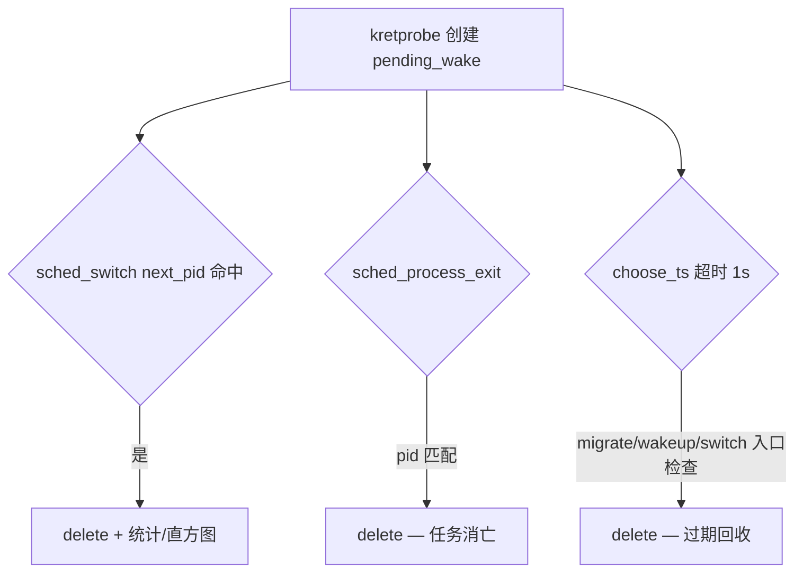

# numawake

观测 CFS 唤醒路径上的 NUMA 相关调度决策：决策层跨 NUMA wake、入队核与首次运行核偏离、runqueue 等待延迟等。

- 产品指标定义见 [SEMANTICS.md](SEMANTICS.md)

**目标内核**：Linux 4.19（`vmlinux/4.19` + libbpf 0.5.0 + kprobe/kretprobe）。在新内核开发机上编译可以，但运行需在 4.19 目标机上验证。

---

## 构建

依赖：`gcc`、`clang`、`make`；Makefile 会自动 reset libbpf 子模块到 v0.5.0。

```bash
cd numawake
make clean
make              # numawake、numawake_topo、numawake.bpf.o
make numawake     # 仅主程序 ../bin/numawake
make topo         # ../bin/numawake_topo
```

产物：


| 路径                     | 说明               |
| ---------------------- | ---------------- |
| `../bin/numawake`      | 主观测工具            |
| `../bin/numawake_topo` | 打印 sysfs NUMA 拓扑 |


BPF 编译默认 `-mcpu=v1`（4.19 校验器不支持 BPF_J32 / opcode 16）。仅在新内核上调试 BPF 字节码时可 `make BPF_MCPU=probe`。

---

## 运行

### 1. 查看 NUMA 拓扑（可选）

```bash
../bin/numawake_topo
```

### 2. 启动 numawake

```bash
# 全系统，每 3 秒打印累计统计
sudo ../bin/numawake

# 自定义间隔
sudo ../bin/numawake -i 5

# 仅跟踪指定 PID（支持 123,200-205）
sudo ../bin/numawake -p 1234
```

若 tracepoint 挂载失败，可在 4.19 上尝试：

```bash
sudo sysctl -w kernel.perf_event_paranoid=-1
```

### 4. 输出字段

计数为**自进程启动以来的累计值**，不是每个 interval 的增量。


| 字段                  | 含义                                                 |
| ------------------- | -------------------------------------------------- |
| `cross_numa_wake`   | `node(prev_cpu) ≠ node(chosen_cpu)`，决策层跨 NUMA wake |
| `same_numa_wake`    | 决策层同 NUMA 的完整 wake 观测（对照组）                         |
| `landing_deviation` | `enqueue_cpu ≠ first_run_cpu`，入队后首次运行前又被迁走         |
| `sanity_mismatch`   | `chosen_cpu ≠ enqueue_cpu`（调试用，常态应接近 0）            |
| 直方图                 | runqueue 等待延迟（ms），从入队决策到首次 `sched_switch`          |


延迟本质是 **runqueue 等待时间**（与 [psrun](../psrun/psrun.bpf.c) 同类），不是 NUMA 内存访问延迟。详见 [SEMANTICS.md](SEMANTICS.md)。

**读直方图注意**：`cross_numa_lat` / `same_numa_lat` 应按**比例**对比（例如 >1 ms 占比），不要直接比较绝对柱高——`same_numa_wake` 样本量通常远大于 `cross_numa_wake`。

---

## 业务解读与调优

numawake 是 **调度侧 locality 体检仪**：回答「唤醒决策是否跨 NUMA、入队后排队久不久、入队后是否稳定落地」。它**不能**单独证明远端内存慢或业务 RT 变差，宜与业务 P99、`numastat` 等同一时间轴对照。

### 唤醒路径与指标锚点

```
select_task_rq_fair(prev_cpu → chosen_cpu)   # 调度器决策；cross/same 看 node(prev) vs node(chosen)
  → [可选] sched_migrate_task(enqueue_cpu)   # 入队前修正；sanity_mismatch = chosen ≠ enqueue
  → sched_wakeup(enqueue_cpu)                # 确认入队
  → runqueue 等待                            # 延迟起点：最后一次 pre-wakeup migrate，否则 wakeup
  → sched_switch(first_run_cpu)              # landing_deviation = enqueue ≠ first_run
```

- **cross / same 分桶**由 `chosen_cpu` 决定，与 `enqueue` / `first_run` 无关。
- **延迟**不从 `select` 起算，避免把「选核 + migrate」与「纯排队」混在一起。

### 业务上能说明什么


| 观测                      | 可支撑的结论（需结合 `-p` 过滤与窗口增量）                     |
| ----------------------- | -------------------------------------------- |
| 某 PID **cross 比例高**     | 该 workload 唤醒路径里，调度器**经常**决策放到唤醒前节点之外的 CPU   |
| cross **长尾比例**明显高于 same | 跨节点 wake **更常**伴随更长 runqueue 等待（尾延迟风险 proxy） |
| **landing_deviation** 高 | 已入队 CPU 与首次运行 CPU 不一致，placement 与负载均衡在「打架」   |
| same 高延迟                | 更像 **节点内 / 目标核过忙**，不一定是跨 NUMA 问题             |
| cross 高但延迟多在 0–1 ms     | 跨节点 wake 频繁，但远端核常更空——可能是追 idle，**未必是坏事**     |


**不能单靠 numawake 断言的**：远端内存 / cache 代价、业务 QPS/RT 根因、「应该绑在哪个 node」（需内存策略、部署拓扑、SLA）。

### 推荐操作流程

1. **锁定对象**：`sudo ./bin/numawake -p <pid> -i 10`，在高峰 / 压测 / 故障窗口各采一段。
2. **看窗口增量**：两次打印相减（累计值会随运行时间单调增）。
3. **对齐拓扑**：`./bin/numawake_topo`。
4. **填决策表**（针对该窗口增量）：


| 模式                            | 优先怀疑                         |
| ----------------------------- | ---------------------------- |
| cross 比例高 + cross 长尾比例高       | locality；绑核 / membind        |
| cross 比例高 + 延迟仍 mostly 0–1 ms | 追空闲；再查内存是否在远端（`numastat -p`） |
| same 比例高 + 延迟长尾高              | 节点内拥塞；IRQ、过载、亲和过窄            |
| landing_deviation 高           | 入队后又被 pull；cpuset 过宽、负载均衡    |


1. **与业务指标对齐**：仅当 cross 升高且业务 P99 同时变差时，才强烈建议动 NUMA/绑核。

### 调优动作（按模式）

**A. cross 高 + cross 长尾明显高于 same**

目标：唤醒后尽量在内存所在节点执行。

```bash
numactl --cpunodebind=0 --membind=0 ./your_app
# 或 taskset -c <node-cpus> ./your_app
echo 0 | sudo tee /proc/sys/kernel/numa_balancing   # 评估全局影响后再用
```

容器 / K8s：考虑 `topologyManager: single-numa-node`、Guaranteed + 明确 CPU/内存请求。

**B. cross 不低，但延迟几乎都在 0–1 ms**

先查内存分布：`numastat -p <pid>`、`/proc/<pid>/numa_maps`。内存已跨节点则 membind+cpunodebind 一起做；内存本地则往往绑 CPU 即可。

**C. same NUMA 高延迟**

查 node 内 CPU 利用率、`mpstat`；考虑 IRQ 绑核、`isolcpus`、避免线程挤在同一 cache domain。

**D. landing_deviation 高**

缩小 cpuset、对延迟敏感进程绑核；与 cross 分开看——「决策没跨节点但被拽走」时重点抑制迁移而非 membind。

### 结论表述模板

> 在时段 T、进程 P 上，cross NUMA wake 占 X%，该类 wake 的 runqueue >1 ms 比例为 A%，同 NUMA 为 B%（约 A/B 倍）；landing_deviation 为 Y%。建议对 P 做 numactl 试点后复测 cross 比例与业务 P99。

相对 [SEMANTICS.md](SEMANTICS.md) 默认 baseline（`node(prev_cpu)`），cross 高表示调度器**主动**跨节点决策，**不等于 bug**；是否调优取决于业务对尾延迟与全机利用率的取舍。

---

## 重点逻辑处理

本章说明 BPF 状态机的设计取舍，对应 `numawake.bpf.c`。

### 1. `pending_wake` 的 Key：必须用被唤醒任务的 PID

**问题**：唤醒是异步的。CPU 0 上进程 A 调用 `wake_up_process(B)` 时，`select_task_rq_fair` 运行在 A 的上下文中；随后 `sched_wakeup` 事件里的 `pid` 是 B。

若用 `bpf_get_current_pid_tgid()`（A 的 TID）作 Hash Key，与 `sched_wakeup` / `sched_migrate_task` 的 `ctx->pid`（B）无法关联，状态机完全失效。

**处理**：


| 阶段                                    | Key 来源                                                   |
| ------------------------------------- | -------------------------------------------------------- |
| kprobe `select_task_rq_fair`          | `bpf_probe_read` 读 `p->pid` — 参数 `task_struct *p` 即被唤醒任务 |
| kretprobe                             | 从 `choose_args[cpu]` 取出入口已保存的 wakee `pid`                |
| `sched_wakeup` / `sched_migrate_task` | `ctx->pid`                                               |
| `pending_wake` map                    | **统一以 wakee `pid` 为 key**                                |


`choose_args` 以 `**bpf_get_smp_processor_id()`** 为 key，仅在 kprobe 入口与 kretprobe 之间暂存参数。**禁止在 kretprobe 用 `PT_REGS_PARM1` 取 `p`**：函数返回时 x86_64 参数寄存器已失效，会导致 `pending_wake` 永远建不起来。

**注意**：内核 `task_struct.pid` 是线程级 ID（用户态常称 TID）；按进程聚合需在用户态用 `tgid` 或额外字段。

### 2. `enqueue_cpu` 与 `enqueue_ts`（migrate + wakeup）

唤醒路径典型顺序：

```
select_task_rq_fair → [可选] sched_migrate_task × N → sched_wakeup → runqueue → sched_switch
```

`**enqueue_cpu**`：最后一次「入队决策」的 CPU。入队前每次 `sched_migrate_task` 将 `enqueue_cpu` 更新为 `dest_cpu`；`sched_wakeup` 再确认为 `target_cpu`。

`**enqueue_ts`（延迟起点）**：`latency_ns = t(first_sched_switch) - enqueue_ts`。

语义为「**入队前**最后一次确定入队位置的时刻」：


| 场景                           | `enqueue_ts`                    |
| ---------------------------- | ------------------------------- |
| 无 migrate                    | `sched_wakeup` 时刻               |
| migrate 在 wakeup 之前（可多次）     | **最后一次** pre-wakeup migrate 的时刻 |
| 仅 `select`，从未 migrate/wakeup | 保持 0，不参与延迟（后续 switch 仍回收条目）     |


**入队后的 migrate 必须忽略**：任务已 `sched_wakeup` 入队后，负载均衡可能再次 `sched_migrate_task`。若继续刷新 `enqueue_ts`，会把已在队列中等待的时间从延迟里扣掉，指标偏小。

**处理**：`handle_sched_migrate_task` 在 `NUMAWAKE_PF_SEEN_WAKEUP` 已置位时直接返回。入队后的漂移由 `LANDING_DEVIATION`（`enqueue_cpu != first_run_cpu`）在 `sched_switch` 阶段判定。

### 3. 生命周期闭环与防泄漏

**处理 — 三条回收路径**：




1. `**sched_switch**`：`next_pid` 命中则分类（cross/same NUMA、landing deviation）、更新直方图、`delete`。
2. `**sched_process_exit**`：按 `ctx->pid` 删除，覆盖 SIGKILL 等路径。
3. **超时**：`pending_try_expire()`；`now - choose_ts > 1s` 则删除。

---

## 遇到的问题与解决方法


| 问题                                | 影响                                           | 解决方法                                                                  |
| --------------------------------- | -------------------------------------------- | --------------------------------------------------------------------- |
| 用唤醒者 TID 作 Key                    | `select` 与 `sched_wakeup` 无法关联               | 全程使用 wakee `p->pid` / `ctx->pid`；见 §1                                 |
| kretprobe 用 `PT_REGS_PARM1` 取 `p` | `choose_args` 查不到，统计恒为 0                     | 入口/返回用 **CPU ID** 配对 `choose_args`；见 §1                               |
| `vmlinux.h` 默认 CO-RE              | libbpf 加载报 `failed to find valid kernel BTF` | 编译加 `-DBPF_NO_PRESERVE_ACCESS_INDEX`                                  |
| `-mcpu=v3` / `probe`              | 4.19 加载报 `unknown opcode 16`                 | 默认 `-mcpu=v1`（`make BPF_MCPU=probe` 仅新内核调试）                           |
| tracepoint 挂载                     | `PERF_EVENT_IOC_SET_BPF` / bpf_link 权限问题     | 4.19 用 `numawake_attach.c` legacy attach；必要时 `perf_event_paranoid=-1` |
| 入队后 migrate 刷新 `enqueue_ts`       | runqueue 延迟被低估                               | `SEEN_WAKEUP` 后忽略 migrate；见 §2                                        |
| `select` 后无 wakeup（SIGKILL 等）     | `pending_wake` 泄漏                            | `sched_process_exit` + 1s 超时；见 §3                                     |
| `select_task_rq_fair` 非 wake 调用   | 误建 pending、污染统计                              | 非 wake 过滤为后续项                                                         |
| 4.19 无 BTF/fexit                  | 无法 CO-RE 读参                                  | kprobe + kretprobe + `PT_REGS_RC`                                  |


---

## 文件说明


| 文件                    | 说明                                     |
| --------------------- | -------------------------------------- |
| `numawake.h`          | 用户态 / BPF 共用 ABI（事件结构、标志位、stats）       |
| `numawake_bpf.h`      | 仅 BPF 侧辅助结构与 map 标志                    |
| `numawake.bpf.c`      | 主 BPF 程序（状态机、直方图）                      |
| `numawake.c`          | 用户态加载、探针挂载、周期性打印                       |
| `numawake_attach.c`   | tracepoint legacy 挂载（4.19 / 受限环境）      |
| `numawake_print.c`    | log2 延迟直方图打印                           |
| `numawake_topology.`* | 从 sysfs 构建 `cpu_to_node[]` 并写入 BPF map |
| `numawake_topo`       | 打印 sysfs 解析结果（`make topo`）             |
| `SEMANTICS.md`        | 指标定义与产品语义                              |


