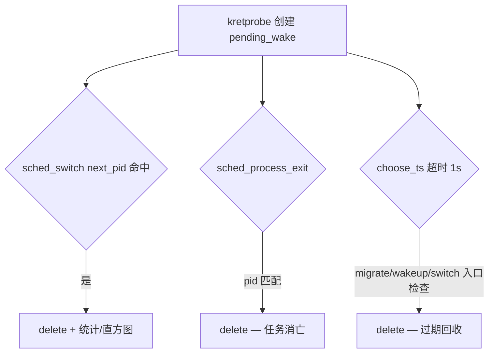

# numawake

观测 CFS 唤醒路径上的 NUMA 相关调度决策：决策层跨 NUMA wake、入队核与首次运行核偏离、runqueue 等待延迟等。

- 产品指标定义见 [SEMANTICS.md](SEMANTICS.md)
- `select_task_rq_fair` 挂载可行性见 [VERIFY_SYMBOL.md](VERIFY_SYMBOL.md)

**目标内核**：Linux 4.19（`vmlinux/4.19` + libbpf 0.5.0 + kprobe/kretprobe）。在新内核开发机上编译可以，但运行需在 4.19 目标机上验证。

---

## 构建

依赖：`gcc`、`clang`、`make`；Makefile 会自动 reset libbpf 子模块到 v0.5.0。

```bash
cd numawake
make clean
make              # 全部：verify_symbol、numawake、numawake_topo、numawake.bpf.o
make numawake     # 仅主程序 ../bin/numawake
make ../bin/verify_symbol
make topo         # ../bin/numawake_topo
```

产物：

| 路径 | 说明 |
|------|------|
| `../bin/numawake` | 主观测工具 |
| `../bin/verify_symbol` | 探针可挂载性与事件比例验证 |
| `../bin/numawake_topo` | 打印 sysfs NUMA 拓扑 |

BPF 编译默认 `-mcpu=v1`（4.19 校验器不支持 BPF_J32 / opcode 16）。仅在新内核上调试 BPF 字节码时可 `make BPF_MCPU=probe`。

---

## 运行

### 1. 验证探针（推荐先做）

```bash
sudo ../bin/verify_symbol -d 5
```

期望：`kretprobe 'select_task_rq_fair': attach OK`，且 `select_task_rq_fair` 与 `sched_wakeup` 计数均明显大于 0。详见 [VERIFY_SYMBOL.md](VERIFY_SYMBOL.md)。

### 2. 查看 NUMA 拓扑（可选）

```bash
../bin/numawake_topo
```

### 3. 启动 numawake

```bash
# 全系统，每 3 秒打印累计统计
sudo ../bin/numawake

# 自定义间隔
sudo ../bin/numawake -i 5

# 仅跟踪指定 PID（支持 123,200-205）
sudo ../bin/numawake -p 1234
```

若 tracepoint 挂载失败，可在 4.19 上尝试：

```bash
sudo sysctl -w kernel.perf_event_paranoid=-1
```

### 4. 输出字段

计数为**自进程启动以来的累计值**，不是每个 interval 的增量。

| 字段 | 含义 |
|------|------|
| `cross_numa_wake` | `node(prev_cpu) ≠ node(chosen_cpu)`，决策层跨 NUMA wake |
| `same_numa_wake` | 决策层同 NUMA 的完整 wake 观测（对照组） |
| `landing_deviation` | `enqueue_cpu ≠ first_run_cpu`，入队后首次运行前又被迁走 |
| `sanity_mismatch` | `chosen_cpu ≠ enqueue_cpu`（调试用，常态应接近 0） |
| 直方图 | runqueue 等待延迟（ms），从入队决策到首次 `sched_switch` |

延迟本质是 **runqueue 等待时间**（与 [psrun](../psrun/psrun.bpf.c) 同类），不是 NUMA 内存访问延迟。详见 [SEMANTICS.md](SEMANTICS.md)。

---

## 重点逻辑处理

本章说明 BPF 状态机的设计取舍，对应 `numawake.bpf.c`。

### 1. `pending_wake` 的 Key：必须用被唤醒任务的 PID

**问题**：唤醒是异步的。CPU 0 上进程 A 调用 `wake_up_process(B)` 时，`select_task_rq_fair` 运行在 A 的上下文中；随后 `sched_wakeup` 事件里的 `pid` 是 B。

若用 `bpf_get_current_pid_tgid()`（A 的 TID）作 Hash Key，与 `sched_wakeup` / `sched_migrate_task` 的 `ctx->pid`（B）无法关联，状态机完全失效。

**处理**：

| 阶段 | Key 来源 |
|------|----------|
| kprobe `select_task_rq_fair` | `bpf_probe_read` 读 `p->pid` — 参数 `task_struct *p` 即被唤醒任务 |
| kretprobe | 从 `choose_args[cpu]` 取出入口已保存的 wakee `pid` |
| `sched_wakeup` / `sched_migrate_task` | `ctx->pid` |
| `pending_wake` map | **统一以 wakee `pid` 为 key** |

`choose_args` 以 **`bpf_get_smp_processor_id()`** 为 key，仅在 kprobe 入口与 kretprobe 之间暂存参数。**禁止在 kretprobe 用 `PT_REGS_PARM1` 取 `p`**：函数返回时 x86_64 参数寄存器已失效，会导致 `pending_wake` 永远建不起来。

**注意**：内核 `task_struct.pid` 是线程级 ID（用户态常称 TID）；按进程聚合需在用户态用 `tgid` 或额外字段。

### 2. `enqueue_cpu` 与 `enqueue_ts`（migrate + wakeup）

唤醒路径典型顺序：

```
select_task_rq_fair → [可选] sched_migrate_task × N → sched_wakeup → runqueue → sched_switch
```

**`enqueue_cpu`**：最后一次「入队决策」的 CPU。入队前每次 `sched_migrate_task` 将 `enqueue_cpu` 更新为 `dest_cpu`；`sched_wakeup` 再确认为 `target_cpu`。

**`enqueue_ts`（延迟起点）**：`latency_ns = t(first_sched_switch) - enqueue_ts`。

语义为「**入队前**最后一次确定入队位置的时刻」：

| 场景 | `enqueue_ts` |
|------|----------------|
| 无 migrate | `sched_wakeup` 时刻 |
| migrate 在 wakeup 之前（可多次） | **最后一次** pre-wakeup migrate 的时刻 |
| 仅 `select`，从未 migrate/wakeup | 保持 0，不参与延迟（后续 switch 仍回收条目） |

**入队后的 migrate 必须忽略**：任务已 `sched_wakeup` 入队后，负载均衡可能再次 `sched_migrate_task`。若继续刷新 `enqueue_ts`，会把已在队列中等待的时间从延迟里扣掉，指标偏小。

**处理**：`handle_sched_migrate_task` 在 `NUMAWAKE_PF_SEEN_WAKEUP` 已置位时直接返回。入队后的漂移由 `LANDING_DEVIATION`（`enqueue_cpu != first_run_cpu`）在 `sched_switch` 阶段判定。

### 3. 生命周期闭环与防泄漏

**处理 — 三条回收路径**：



1. **`sched_switch`**：`next_pid` 命中则分类（cross/same NUMA、landing deviation）、更新直方图、`delete`。
2. **`sched_process_exit`**：按 `ctx->pid` 删除，覆盖 SIGKILL 等路径。
3. **超时**：`pending_try_expire()`；`now - choose_ts > 1s` 则删除。

---

## 遇到的问题与解决方法

| 问题 | 影响 | 解决方法 |
|------|------|----------|
| 用唤醒者 TID 作 Key | `select` 与 `sched_wakeup` 无法关联 | 全程使用 wakee `p->pid` / `ctx->pid`；见 §1 |
| kretprobe 用 `PT_REGS_PARM1` 取 `p` | `choose_args` 查不到，统计恒为 0 | 入口/返回用 **CPU ID** 配对 `choose_args`；见 §1 |
| `vmlinux.h` 默认 CO-RE | libbpf 加载报 `failed to find valid kernel BTF` | 编译加 `-DBPF_NO_PRESERVE_ACCESS_INDEX` |
| `-mcpu=v3` / `probe` | 4.19 加载报 `unknown opcode 16` | 默认 `-mcpu=v1`（`make BPF_MCPU=probe` 仅新内核调试） |
| tracepoint 挂载 | `PERF_EVENT_IOC_SET_BPF` / bpf_link 权限问题 | 4.19 用 `numawake_attach.c` legacy attach；必要时 `perf_event_paranoid=-1` |
| 入队后 migrate 刷新 `enqueue_ts` | runqueue 延迟被低估 | `SEEN_WAKEUP` 后忽略 migrate；见 §2 |
| `select` 后无 wakeup（SIGKILL 等） | `pending_wake` 泄漏 | `sched_process_exit` + 1s 超时；见 §3 |
| `select_task_rq_fair` 非 wake 调用 | 误建 pending、污染统计 | 非 wake 过滤为后续项；先用 `verify_symbol` 看 non-wake % |
| 4.19 无 BTF/fexit | 无法 CO-RE 读参 | kprobe + kretprobe + `PT_REGS_RC`；见 VERIFY_SYMBOL.md |

---

## 文件说明

| 文件 | 说明 |
|------|------|
| `numawake.h` | 用户态 / BPF 共用 ABI（事件结构、标志位、stats） |
| `numawake_bpf.h` | 仅 BPF 侧辅助结构与 map 标志 |
| `numawake.bpf.c` | 主 BPF 程序（状态机、直方图） |
| `numawake.c` | 用户态加载、探针挂载、周期性打印 |
| `numawake_attach.c` | tracepoint legacy 挂载（4.19 / 受限环境） |
| `numawake_print.c` | log2 延迟直方图打印 |
| `numawake_topology.*` | 从 sysfs 构建 `cpu_to_node[]` 并写入 BPF map |
| `numawake_topo` | 打印 sysfs 解析结果（`make topo`） |
| `verify_symbol.*` | `select_task_rq_fair` 可挂载性与事件比例验证 |
| `SEMANTICS.md` | 指标定义与产品语义 |
